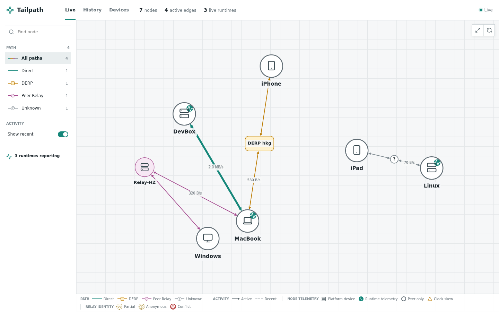
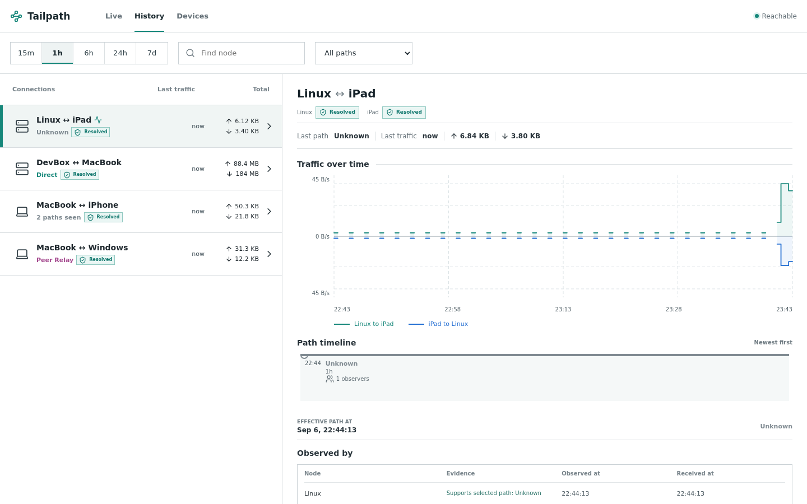
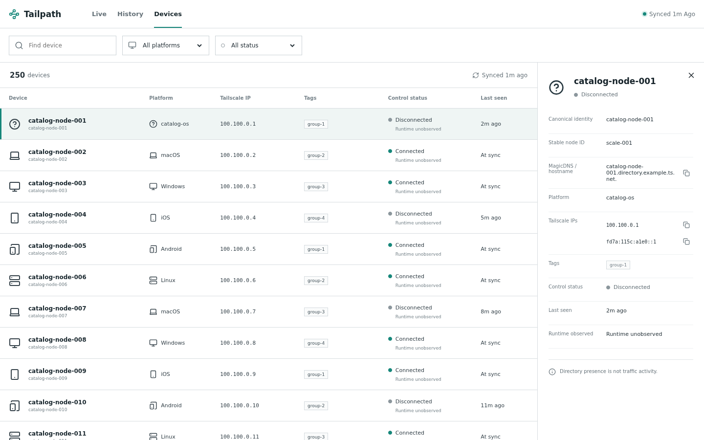

# Tailpath

[中文说明](README.zh-CN.md)

Tailpath is a passive, real-time topology and traffic-path viewer for Tailscale
networks. It shows which nodes are communicating, how much traffic is flowing,
and whether each observed path is direct, DERP-relayed, peer-relayed, or
unknown.

> **Status: usable alpha.** Tailpath is running in real Tailnets and the core
> Live, History, collector, Peer Relay, tsnet exporter, and optional Devices
> directory workflows are usable today. Interfaces and storage behavior may
> still change before 1.0; see the [roadmap](docs/roadmap.md) for the remaining
> qualification work.

## Sample UI

The screenshots below are generated from deterministic mock data. All device
names, addresses, traffic, paths, and directory records are synthetic.

### Live topology



### Traffic and path history



### Optional device directory



## What works today

- Live active/recent traffic topology with directional rates and distinct
  Direct, DERP, Peer Relay, and Unknown paths.
- Seven-day traffic history, path transitions, observer provenance, and
  canonical node reconciliation.
- Passive collectors for normal `tailscaled` nodes, with reconnect, resync,
  counter-reset, and clock-skew handling.
- Peer Relay session telemetry and an exporter API for applications embedding
  one or more `tsnet` runtimes.
- An optional, read-only Devices API directory for control-plane metadata
  enrichment. Directory presence never creates traffic edges or implies that a
  device is online.
- A self-hosted Linux Compose server, OCI image, SQLite persistence, and native
  collector archives.

## Alpha support boundaries

- The server is supported as a Linux Compose deployment. Linux collectors are
  the primary supported collector path.
- macOS and Windows collector archives are available as previews; their
  platform support is still being qualified.
- Tailpath is best-effort and deliberately avoids continuous active probes. It
  only shows traffic visible to the observers you deploy.
- Tailpath does not promise a complete Tailnet inventory. The optional Devices
  API shows only the directory visible to its read-only OAuth credential, and
  directory devices do not appear in Live unless runtime traffic exists.
- The current operating target is a single self-hosted Tailpath server for one
  Tailnet, with up to 250 nodes and 1,000 visible logical edges.

## Deployment and observers

The central server joins the Tailnet as a dedicated `tsnet` node. Normal
collectors read their local `tailscaled` LocalAPI every two seconds and report
only when non-control peer counters change. This keeps collection passive and
avoids the path changes that active probing can cause.

Use the current release artifacts and follow the
[deployment guide](docs/deployment.md) to configure the server, native
collectors, optional Devices API enrichment, and upgrades. Applications that
embed Tailscale can use the public alpha `exporter` packages; see the runnable
[multi-instance tsnet example](examples/tsnet-multi/README.md).

### tsbridge integration

Our maintained [tsbridge fork](https://github.com/GhostFlying/tsbridge) can
report every embedded `tsnet.Server` as its own Tailpath runtime. The current
[Tailpath integration prerelease](https://github.com/GhostFlying/tsbridge/releases/tag/v0.16.0-tailpath.1)
requires Tailpath v0.4.0 or newer and keeps export fail-open if Tailpath is
unavailable.

Configure the fork with:

```toml
[tailpath]
server_url = "http://tailpath.example.ts.net:8080"
reporter_hostname = "tsbridge-tailpath-reporter"
reporter_tags = ["tag:tailpath-reporter"]
```

The reporter is a dedicated persistent `tsnet` identity used to submit the
observations; each tsbridge service remains a separate Tailnet node in the
graph. This integration is currently distributed from the Tailpath fork, not
the upstream tsbridge project.

## Principles

- Observe runtime state already maintained by Tailscale.
- Never continuously probe peers to discover paths.
- Model traffic relationships, not ACL reachability.
- Preserve observation provenance and represent missing evidence as unknown.
- Keep topology and traffic data inside the self-hosted deployment.

## Development

Open the repository in its dev container, then run:

```sh
make bootstrap
make check
```

See [development](docs/development.md), [architecture](docs/architecture.md),
and [contributing](CONTRIBUTING.md) before making changes.

## License

Apache-2.0. See [LICENSE](LICENSE).
