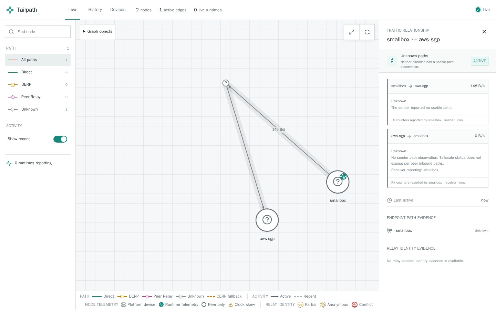
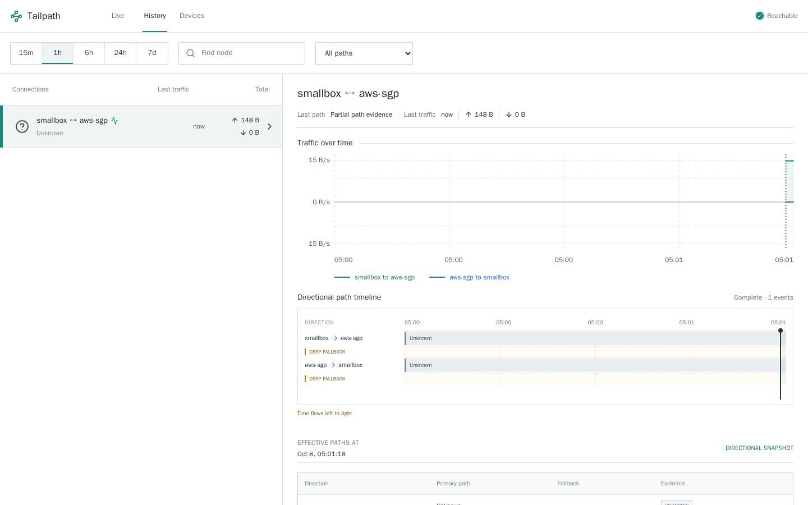
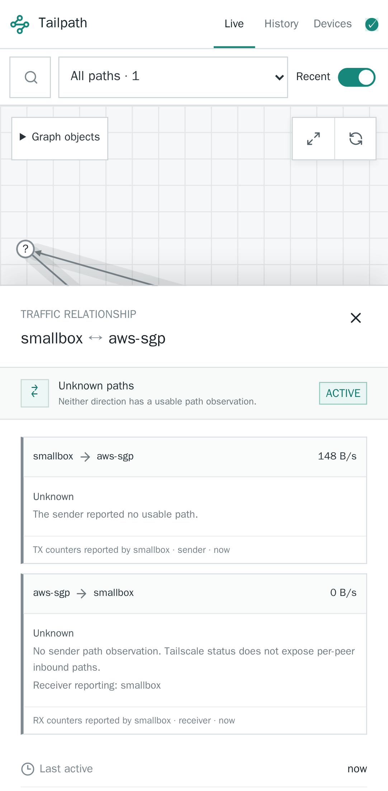
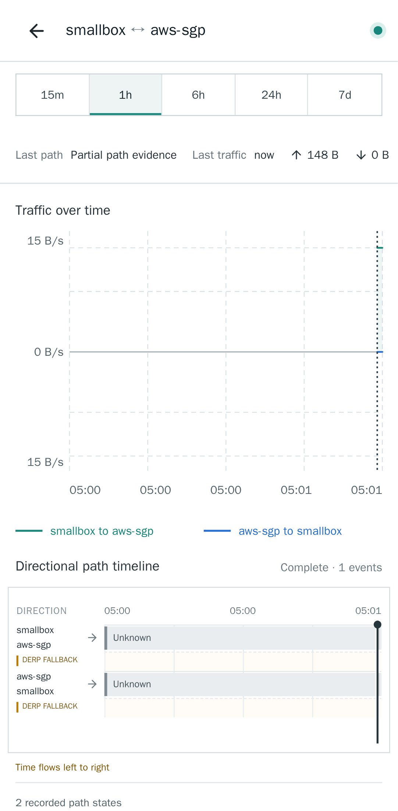

# Unconfirmed runtime path verification

Synthetic status fixture: sender smallbox, peer aws-sgp, TX attempts, no received bytes or confirmed route. No real host keys, endpoints, user identity, or production screenshots are included.

The shared normalization regressions prove that home DERP/selected endpoints with zero LastHandshake normalize to Unknown while raw counters remain intact. The embedded LocalAPI regression verifies Unknown becomes DERP only after handshake confirmation. Browser tests separately verify that normalized Unknown output stays Unknown in Live/History and produces no DERP route, at desktop and mobile sizes.

Canonical development image: tailpath-devcontainer:playwright, based on the repository dev-container toolchain. Full make check passed: generated files, shell harnesses, Go formatting/vet/tests, web type/format checks, 117 web unit tests, production build, and browser suite (81 passed, 33 pre-existing conditional skips). New unconfirmed-path test passes in both Chromium projects. Screenshots visually inspected; History horizontal overflow and page errors checked by the regression.

